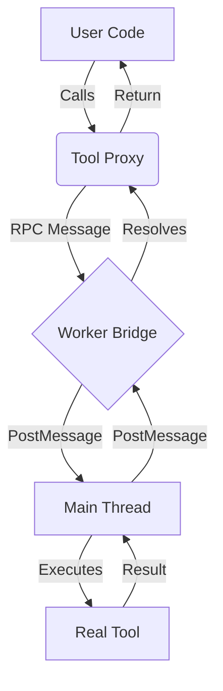

# The Bug That Passed Every Test: A Story About Silent Failures

The code worked perfectly. The tests passed. The feature was "shipped."

There was just one problem: it never actually worked.

## The Setup

We're building Casys PML, a platform where AI agents can execute code with access to external tools
via the Model Context Protocol (MCP). Think of it as giving an LLM the ability to call APIs, query
databases, or interact with services—all within a sandboxed environment.

The architecture looked clean:

```typescript
// Wrap the MCP client to expose tools
const tools = wrapMCPClient(client);

// Execute user code with tool access
executor.execute(code, tools);
```

Simple. Elegant. Completely broken.

## The Silent Failure

Inside our executor, we needed to pass context to an isolated Worker. Workers in Deno (and browser
environments) communicate through structured cloning—essentially, `JSON.stringify` under the hood.

Here's the thing about JavaScript functions: they don't serialize.

```typescript
const tools = {
  search: async (query) => {/* ... */},
  fetch: async (url) => {/* ... */},
};

JSON.stringify(tools);
// Result: "{}"
```

Our MCP tools—carefully wrapped, properly typed—vanished into thin air every single time the
executor ran. No error. No warning. Just... nothing.

## Why Every Test Passed

This is the part that still bothers me.

Our test suite was comprehensive. Unit tests. Integration tests. End-to-end tests. All green. Here's
why:

1. **Unit tests** tested the wrapping logic in isolation—functions existed, so tests passed
2. **Integration tests** used mock tool responses—the mock data serialized fine
3. **E2E tests** verified the executor ran code—it did, just without tools

We never had a test that:

- Created real MCP tool functions
- Passed them through the serialization boundary
- Actually invoked them from inside the Worker

The gap was invisible because each layer worked correctly in isolation.

## The Discovery

I found this bug while implementing a new feature. A user's code was supposed to call an MCP tool,
and I was debugging why the response was always `undefined`.

```typescript
// Inside the Worker
console.log(typeof tools.search);
// Expected: "function"
// Actual: "undefined"
```

The moment I saw that output, weeks of mysterious "it should work" debugging suddenly made sense.

## The Fix: RPC Bridge Architecture

The solution wasn't a one-liner. We needed to fundamentally rethink how tools cross the Worker
boundary.

### Before: Silent Failure


### After: RPC Bridge Solution


The key insights:

1. **Send definitions, not functions**: Tool names, parameter schemas, and descriptions all
   serialize perfectly
2. **Generate proxies in the Worker**: Create stub functions that look like tools but actually send
   RPC messages
3. **Bridge with message passing**: `postMessage` handles the serialization; we just need
   request/response correlation
4. **Trace natively**: No more parsing stdout—the RPC layer gives us structured telemetry for free

Here's what the proxy generation looks like:

```typescript
function createToolProxy(definition: ToolDefinition): ToolFunction {
  return async (...args) => {
    const requestId = crypto.randomUUID();

    // Send RPC request to main thread
    self.postMessage({
      type: "tool-call",
      id: requestId,
      tool: definition.name,
      args,
    });

    // Wait for response
    return waitForResponse(requestId);
  };
}
```

## Architecture Visualization

Here is how the system works using a Mermaid diagram :



# 

<!-- component: ArchitectureDiagram -->

## Lessons Learned

### 1. Test the Boundaries

The bug lived at the serialization boundary. Our tests never crossed it with real data. Now we have
integration tests that:

- Create actual function references
- Pass them through the Worker instantiation
- Verify they're callable on the other side

### 2. Silent Failures Are the Worst Failures

An error would have saved weeks. `JSON.stringify` silently dropping functions is "correct"
behavior—but it's a footgun in architectures that assume objects survive serialization.

Consider adding explicit checks:

```typescript
function assertSerializable(obj: unknown, path = "root"): void {
  if (typeof obj === "function") {
    throw new Error(`Cannot serialize function at ${path}`);
  }
  // ... recurse through object properties
}
```

### 3. "It Works" ≠ "It Does What We Think"

The executor ran. Code executed. Tests passed. But the feature—tool access for AI agents—was
completely non-functional.

Passing tests prove your tests pass. They don't prove your software works.

## The Takeaway

Sometimes the most dangerous bugs are the ones that fail silently. They don't crash your app. They
don't throw errors. They just... don't do the thing you built them to do.

If you're building systems with serialization boundaries—Workers, iframes, cross-process
communication—test the boundary explicitly. Don't assume objects survive the journey intact.

---

_What's the sneakiest bug you've ever found? I'd love to hear your war stories._
