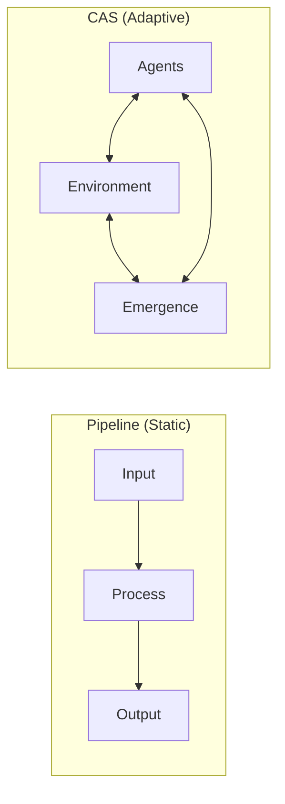
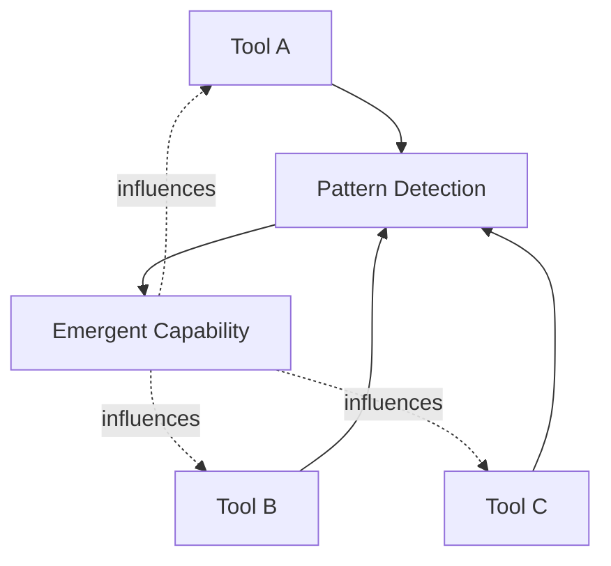
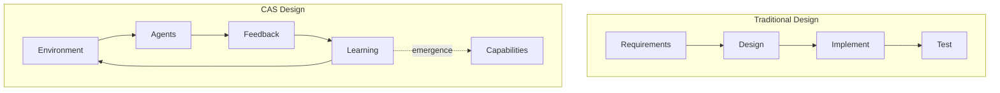

# Why AI Agents Should Be Complex Adaptive Systems

> From assembly lines to ecosystems: rethinking AI agent architecture

## The Static Agent Problem

Most AI agents work like assembly lines:

```
Input → LLM → Tools → Output → Done
```

Every interaction starts from scratch. They don't learn from execution. They don't adapt to your patterns. They're **stateless by design**.

But real intelligence isn't a pipeline—it's a **living system**.

## What Is a Complex Adaptive System?

A Complex Adaptive System (CAS) is a system where:

1. **Multiple agents interact** and influence each other
2. **Feedback loops** create continuous adaptation
3. **Emergent behaviors** arise that nobody programmed
4. **The whole exceeds the sum of its parts**

Examples in nature: ecosystems, immune systems, economies, ant colonies.



The difference? A pipeline *produces*. A CAS *evolves*.

## The Four Properties of CAS

### 1. Emergence

Complex behaviors arise from simple rules. No central controller designs them—they **self-organize**.

In an AI agent context: capabilities emerge from repeated tool combinations, not from explicit programming.



### 2. Feedback Loops

Actions influence future actions. The system learns from outcomes and adjusts behavior.

| Loop Type | Timescale | Effect |
|-----------|-----------|--------|
| Positive | Fast | Amplifies successful patterns |
| Negative | Slow | Dampens unsuccessful patterns |
| Meta | Very slow | Changes how the system learns |

### 3. Adaptation

The system modifies itself in response to environment changes. Not through reprogramming—through **learning**.

### 4. Non-linearity

Small changes can have large effects (butterfly effect). The system is sensitive to initial conditions and history matters.

## Why This Matters for AI Agents

| Static Agent | Complex Adaptive Agent |
|--------------|------------------------|
| Forgets between sessions | Builds persistent memory |
| Same output for same input | Personalized to context + history |
| Brittle on edge cases | Gracefully adapts |
| Capabilities are hardcoded | Capabilities emerge |
| Performance is fixed | Performance improves over time |

## The Paradigm Shift

Traditional AI engineering asks: *"How do I program this behavior?"*

CAS thinking asks: *"How do I create conditions for this behavior to emerge?"*

Instead of designing capabilities, you design **feedback loops**. Instead of coding rules, you create **environments where rules evolve**.



## Measuring Emergence

You can't improve what you can't measure. CAS requires new metrics:

| Metric | What It Measures |
|--------|-----------------|
| **Graph Entropy** | Complexity of relationships |
| **Cluster Stability** | How stable are emergent groupings? |
| **Diversity Index** | Variety of emergent patterns |
| **Adaptation Velocity** | Speed of learning |
| **Phase Transitions** | Qualitative system changes |

When entropy suddenly shifts, the system is **reorganizing**—a sign of healthy adaptation.

## The Bottom Line

Building AI agents as Complex Adaptive Systems means:

1. **Design for emergence**, not just functionality
2. **Instrument feedback loops**, not just outputs
3. **Measure adaptation**, not just accuracy
4. **Expect surprises**—that's the system working

The result? AI that doesn't just *execute*—it **evolves**.

---

## References

- Holland, J. H. (1992). "Complex Adaptive Systems." *Daedalus*, 121(1), 17-30.
- Kauffman, S. (1995). *At Home in the Universe: The Search for Laws of Self-Organization*.
- Mitchell, M. (2009). *Complexity: A Guided Tour*.

#ComplexSystems #AIArchitecture #Emergence #SystemsThinking
