# DAG vs Chain Workflows: Why Graphs Beat Lines

> Simple is good. But sometimes simple is too simple.

## The Chain Model

Most AI frameworks use chains: LangChain, CrewAI, AutoGPT. One step feeds into the next.

| Strength | Weakness |
|----------|----------|
| Easy to understand | No parallelism |
| Simple debugging | One failure stops all |
| Predictable order | Can't insert steps mid-run |

**The problem:** Everything is sequential, even when it doesn't need to be.

Consider deploying an app: you need to build Docker images AND run tests. These are independent—why wait for one to finish before starting the other?

## The DAG Model

A **Directed Acyclic Graph** (DAG) models workflows as they really are: a network of dependencies.

Key properties:
- **Directed**: Edges have direction (A must complete before B)
- **Acyclic**: No loops (you can't depend on your own output)
- **Graph**: Multiple paths, multiple inputs/outputs

Steps B and C can run **in parallel**—they only share a common ancestor, not a direct dependency.

## Why DAGs Win

### 1. Parallelism

Independent tasks run simultaneously. Same work, less time.

Real example from deployment:

| Task | Duration | Dependencies |
|------|----------|--------------|
| Build Docker | 30s | None |
| Run Tests | 45s | None |
| Push to Registry | 10s | Build Docker |
| Deploy | 20s | Push, Tests |

**Chain total:** 105s (sequential)
**DAG total:** 75s (Build + Tests in parallel)

### 2. Replanning

Mid-execution changes are inevitable. Something fails. New information arrives. The agent needs to adapt.

| Operation | Chain | DAG |
|-----------|-------|-----|
| Insert step | Rebuild entire chain | Add node, reconnect edges |
| Skip step | Complex state management | Remove node, preserve graph |
| Add parallel branch | Impossible | Natural |

### 3. Resilience

One failure doesn't have to stop everything.

When A2 fails:
- **Chain:** Everything stops. Rollback needed.
- **DAG:** Branch B continues. A1 continues. Only A2's dependents are blocked.

This enables **partial success**: maybe you can't deploy to prod, but staging works. Maybe notifications fail, but the core operation completes.

### 4. Observability

DAGs are self-documenting. The structure reveals:

| Question | How DAG Answers |
|----------|-----------------|
| What's running now? | Nodes with all predecessors complete |
| What's blocked? | Nodes waiting on incomplete predecessors |
| What's the bottleneck? | Node on critical path with longest duration |
| What can run next? | Nodes whose predecessors just completed |

```mermaid
graph TD
    A[✓ Complete] --> B[🔄 Running]
    A --> C[🔄 Running]
    B --> D[⏳ Waiting]
    C --> D
    D --> E[⏳ Waiting]
```

Chains give you a position. DAGs give you a map.

## The Complexity Trade-off

| Aspect | Chain | DAG |
|--------|-------|-----|
| Mental model | Simple | Medium |
| Implementation | Easy | Moderate |
| Parallelism | None | Full |
| Replanning | Hard | Easy |
| Debugging | Linear | Graph-aware needed |

## When To Use Each

| Use Case | Recommendation | Why |
|----------|----------------|-----|
| Simple 3-step script | Chain | Overhead not worth it |
| CI/CD pipeline | DAG | Tests + build can parallelize |
| Data processing | DAG | Multiple data sources |
| User-facing wizard | Chain | Strictly sequential UX |
| Agent workflows | DAG | Dynamic, parallel, resilient |

**Rule of thumb:** If you ever say "these could run at the same time," use a DAG.

## Our Implementation

Casys PML uses DAGs for workflow execution:

**Core operations:**

| Operation | How It Works |
|-----------|--------------|
| Build DAG | Parse task dependencies into adjacency list |
| Find ready nodes | Nodes where all predecessors are complete |
| Execute | Dispatch ready nodes in parallel |
| Handle failure | Mark failed node, propagate to dependents |
| Replan | Insert/remove nodes, recompute ready set |

The DAG integrates with our two-layer architecture:
- **Strategic layer** plans the high-level DAG (capabilities)
- **Tactical layer** executes individual nodes (tools)

---

## References

- Airflow, Prefect, Dagster as DAG workflow examples

#DAG #Workflows #Parallelism #Architecture
