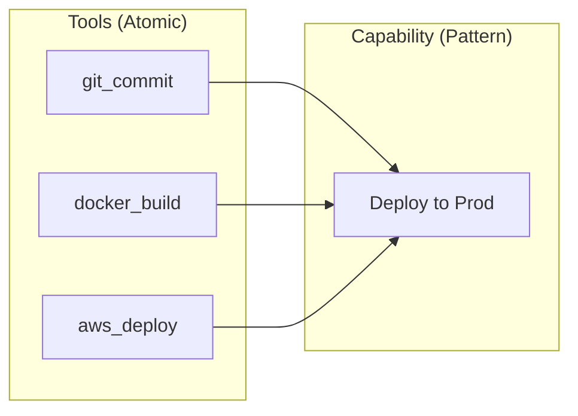
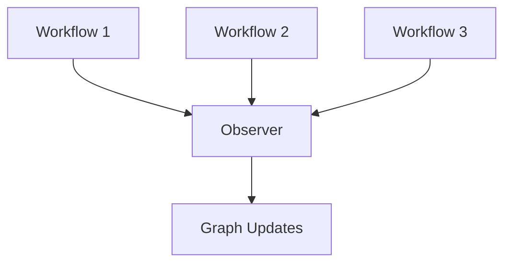
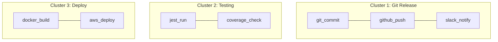
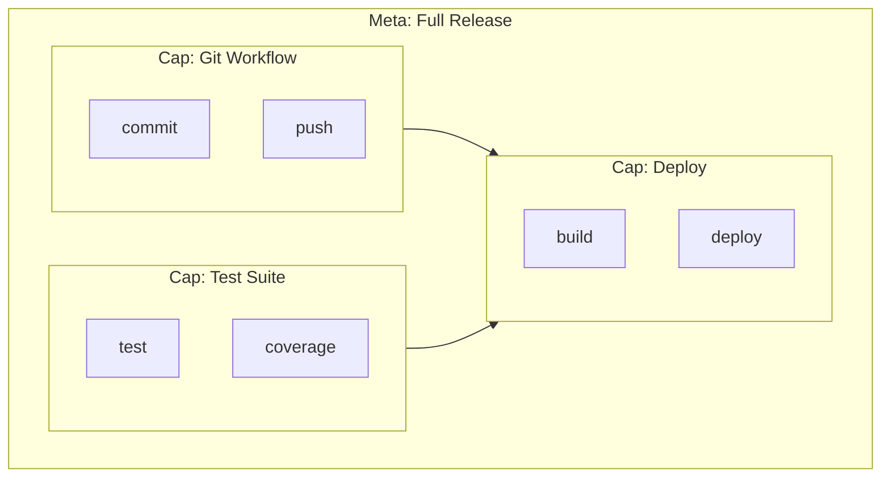
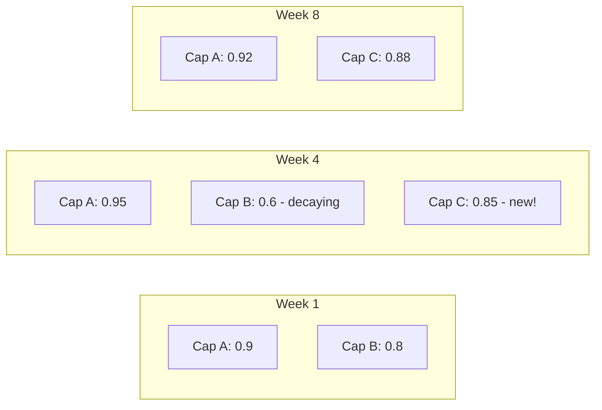

# Emergent Capabilities: Skills Nobody Programmed

> The system learns skills by watching you work

## Tools vs Capabilities

A **tool** is an atomic action: read a file, push to git, send a message.

A **capability** is a coordinated pattern: "deploy to production" involves 5-10 tools working in sequence.



The key insight: **nobody programs capabilities**. They emerge from repeated patterns.

## How Emergence Works

### Step 1: Observation

Every workflow execution is recorded. Which tools were used? In what order? Did it succeed?



### Step 2: Pattern Detection

Tools that frequently appear together get stronger edge weights in the graph.

| Workflow | Tools Used |
|----------|-----------|
| Monday AM | git_commit → github_push → slack_notify |
| Monday PM | git_commit → github_push → slack_notify |
| Tuesday | git_commit → github_push → slack_notify |
| Wednesday | git_commit → github_push |

After enough observations: `{git_commit, github_push, slack_notify}` becomes a pattern.

### Step 3: Clustering

Spectral clustering on the graph Laplacian detects natural groupings:



### Step 4: Capability Birth

When a cluster is stable and confident enough, it becomes a named capability:

| Metric | Threshold | Meaning |
|--------|-----------|---------|
| Co-occurrence count | ≥ 5 | Seen together enough times |
| Cluster stability | ≥ 0.8 | Grouping is consistent |
| Success rate | ≥ 0.7 | Pattern actually works |

The system names it based on the dominant tool or asks the user.

## From Capabilities to Meta-Capabilities

Here's where it gets interesting: **capabilities can contain other capabilities**.



When users repeatedly execute Git Workflow → Test Suite → Deploy in sequence, a meta-capability "Full Release" emerges.

This nesting is unbounded. Meta-meta-capabilities can form. That's why we use n-SuperHyperGraphs.

## Why This Matters

### No Manual Definition

Traditional systems require you to define capabilities upfront:

```
❌ "Define capability 'deploy' with tools X, Y, Z"
```

With emergence:

```
✅ Just use tools. Patterns become capabilities automatically.
```

### Personalization

Different users develop different capabilities based on their workflows:

| User | Emerged Capability | Tools |
|------|-------------------|-------|
| DevOps Alice | "Quick Deploy" | docker_build → ecs_update |
| Developer Bob | "Full CI/CD" | test → build → deploy → notify |
| Data Scientist Carol | "Model Pipeline" | train → evaluate → register |

Same system, different skills—based on usage.

### Continuous Evolution

Capabilities aren't static. As workflows change, capabilities evolve:

- New tools get added to existing capabilities
- Unused patterns fade (confidence decay)

**Future directions** we're exploring:
- Capability merge (when two capabilities consistently co-occur)
- Capability split (when a capability develops distinct sub-patterns)



## The Detection Algorithm

Simplified view of how we detect capabilities:

```
1. Build tool co-occurrence matrix from workflows
2. Compute normalized graph Laplacian
3. Find k smallest eigenvectors (spectral embedding)
4. K-means clustering on embeddings
5. Filter clusters by stability and confidence
6. Register stable clusters as capabilities
```

Key parameters:

| Parameter | What It Controls |
|-----------|-----------------|
| Min cluster size | Ignore tiny patterns |
| Stability threshold | How consistent must grouping be? |
| Confidence decay | How fast do unused patterns fade? |
| Merge threshold | When do similar capabilities combine? |

## Real Examples

Capabilities that emerged in our testing:

| Emerged Capability | Detection Confidence | Tools |
|-------------------|---------------------|-------|
| "Git Commit Flow" | 94% | git_add, git_commit, git_push |
| "PR Review Cycle" | 87% | github_pr_create, github_review, github_merge |
| "Deploy Pipeline" | 91% | docker_build, ecr_push, ecs_update |
| "Bug Investigation" | 78% | grep_search, file_read, git_blame |

None of these were programmed. All emerged from usage patterns.

## The Magic

The magic isn't in any single algorithm. It's in the combination:

1. **Observation** without interruption
2. **Graph structure** that captures relationships
3. **Spectral methods** that find natural clusters
4. **Continuous learning** that adapts over time

The result: a system that learns your skills by watching you work.

---

## References

- Von Luxburg, U. (2007). "A Tutorial on Spectral Clustering." *Statistics and Computing*.
- Blondel, V. et al. (2008). "Fast unfolding of communities in large networks." (Louvain method)

#Emergence #Capabilities #MachineLearning #SelfOrganization
