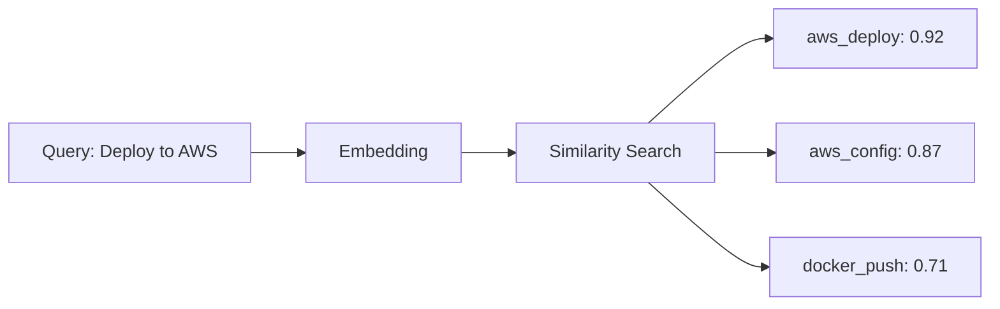
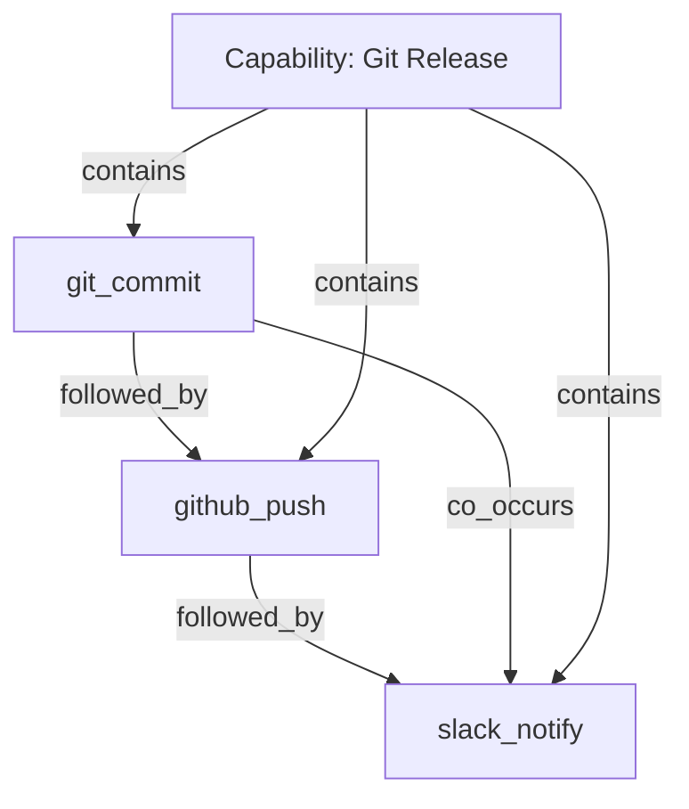
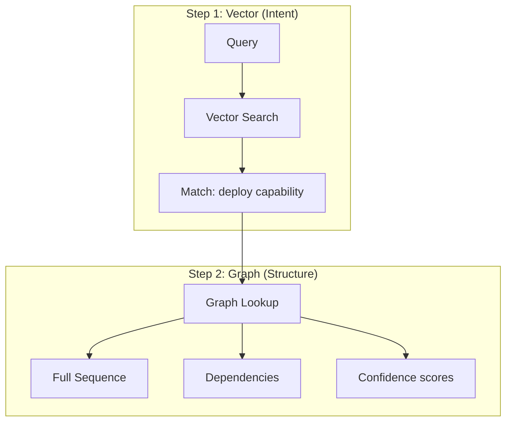
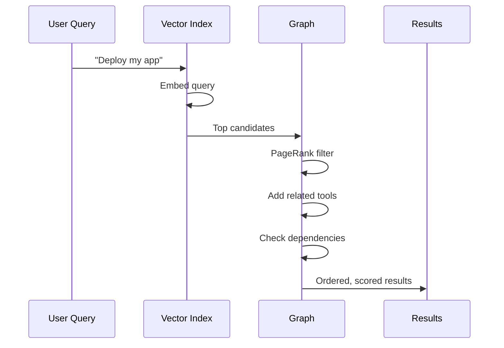

# GraphRAG + VectorRAG: Why You Need Both

> It's not either/or. It's both/and.

## The False Dichotomy

The internet loves a good "X vs Y" debate. GraphRAG vs VectorRAG is no exception.

But here's the thing: **they solve different problems**.

| Approach | Question It Answers |
|----------|-------------------|
| VectorRAG | "What's *similar* to this?" |
| GraphRAG | "What's *related* to this?" |

Similar ≠ Related. And for AI agents, you need both.

## VectorRAG: The Similarity Engine

Vector embeddings capture **semantic similarity**. Two pieces of text that mean similar things will have similar vectors.



**Great for:**
- Finding relevant tools by intent
- Matching user queries to capabilities
- Discovering semantically similar patterns

**Blind to:**
- Execution order ("X must come before Y")
- Structural relationships ("X contains Y")
- Co-occurrence patterns ("X and Y often together")

## GraphRAG: The Relationship Engine

Graphs capture **structural relationships**. Nodes are entities, edges are how they relate.



**Great for:**
- Understanding tool dependencies
- Finding execution sequences
- Detecting capability clusters
- Importance ranking (PageRank)

**Blind to:**
- Semantic meaning of new tools
- Intent matching
- Fuzzy similarity

## Why AI Agents Need Both

Consider this query: *"I want to ship my code to production"*

**VectorRAG alone:**
- Finds tools with similar descriptions
- Returns: `deploy`, `release`, `ship`, `publish`
- Doesn't know which order to use them

**GraphRAG alone:**
- Knows `build` → `test` → `deploy` sequence
- But can't match "ship to production" to `deploy`
- User said "ship", not "deploy"

**Both together:**
1. VectorRAG matches intent → finds `deploy` capability
2. GraphRAG retrieves structure → gets full sequence with dependencies



## Our Hybrid Architecture

In Casys PML, we use both at different stages:

| Stage | Method | Why |
|-------|--------|-----|
| **Discovery** | Vector similarity | Match intent to tools/capabilities |
| **Ranking** | Graph PageRank | Importance based on usage |
| **Sequencing** | Graph traversal | Find execution order |
| **Clustering** | Graph spectral | Detect capability boundaries |
| **Boosting** | Graph co-occurrence | Prefer tools that work together |

### The Flow



### Scoring Formulas

We use different formulas for different modes:

**Active Search (user query):**
```
Score = α × SemanticScore + (1-α) × GraphScore
```
Where α is computed **per node** using embedding coherence—comparing semantic (BGE-M3) vs structural (spectral) embeddings.

**Passive Suggestion (next tool):**
```
Score = 0.6 × CoOccurrence + 0.3 × CommunityBoost + 0.1 × Recency
```
Uses **heat diffusion** to propagate confidence from context to candidates.

**Cold start (<5 observations):** Bayesian fallback with high α (trust semantics only until we have enough graph data).

## When To Use What

| Situation | Primary | Secondary |
|-----------|---------|-----------|
| New tool, never seen before | Vector | — |
| Known tool, finding sequence | Graph | Vector (fallback) |
| Ambiguous query | Vector | Graph (structure) |
| Execution planning | Graph | Vector (alternatives) |
| Capability discovery | Both equally | — |

## The Bottom Line

Don't pick sides. Use both:

- **Vectors** give you semantic understanding
- **Graphs** give you structural knowledge
- **Together** they give you intelligent orchestration

The question isn't "GraphRAG or VectorRAG?"

It's "How do I combine them effectively?"

---

## References

- Lewis, P. et al. (2020). "Retrieval-Augmented Generation." NeurIPS.
- Microsoft Research. (2024). "GraphRAG: Unlocking LLM discovery on narrative private data."

#GraphRAG #VectorRAG #Hybrid #AIArchitecture
