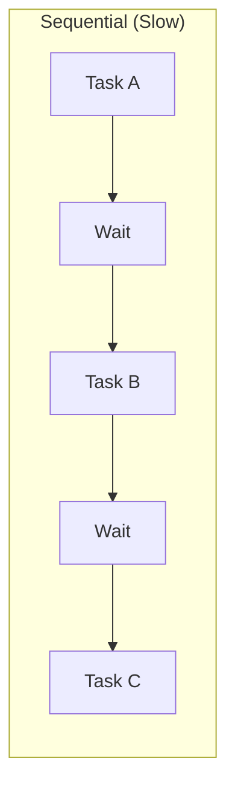
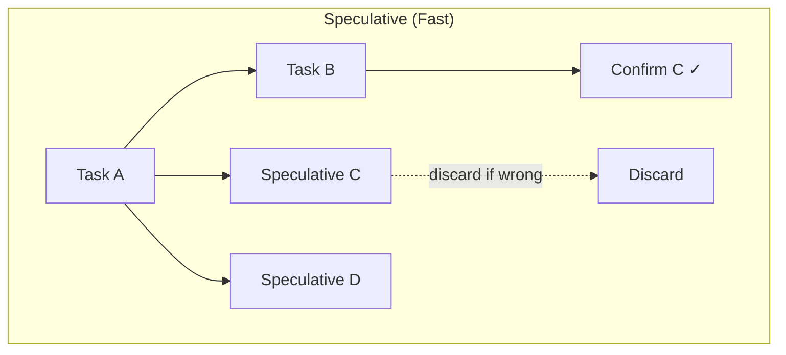
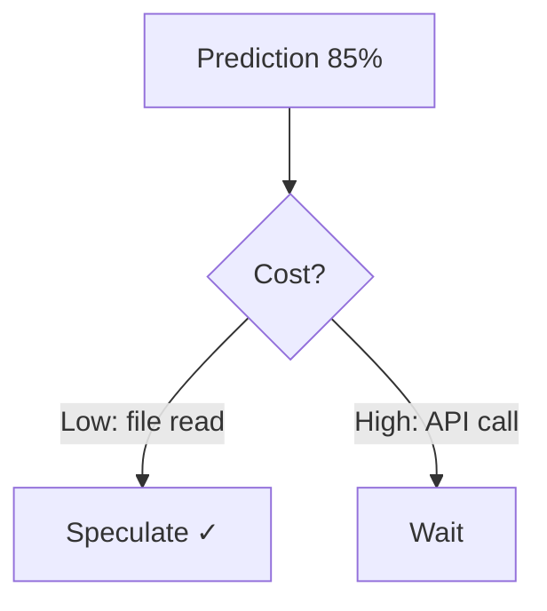
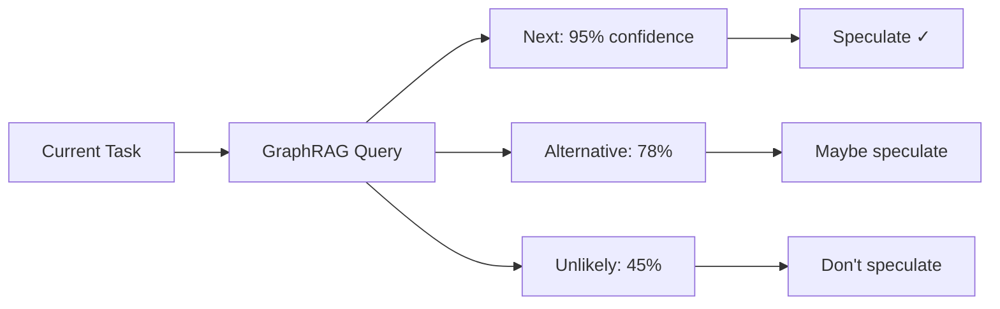
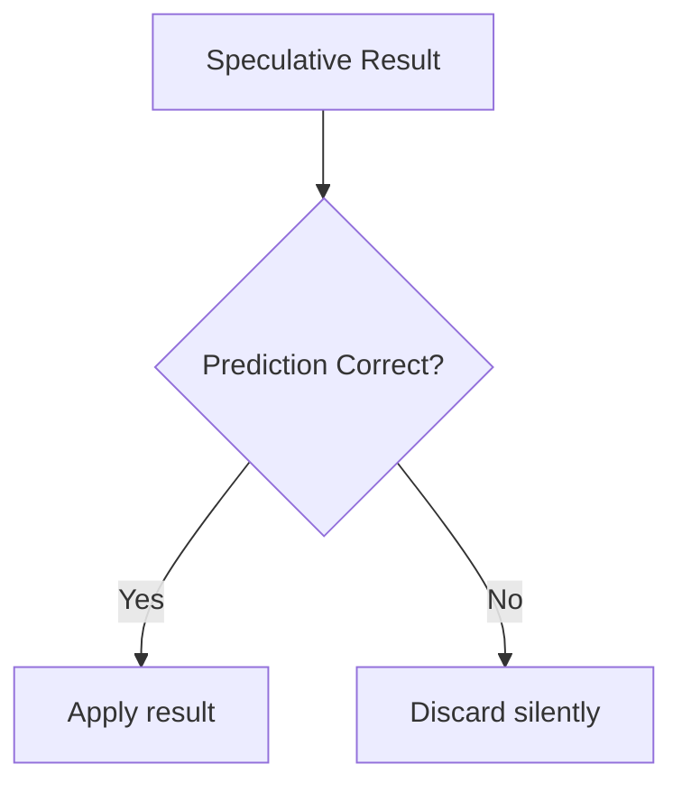
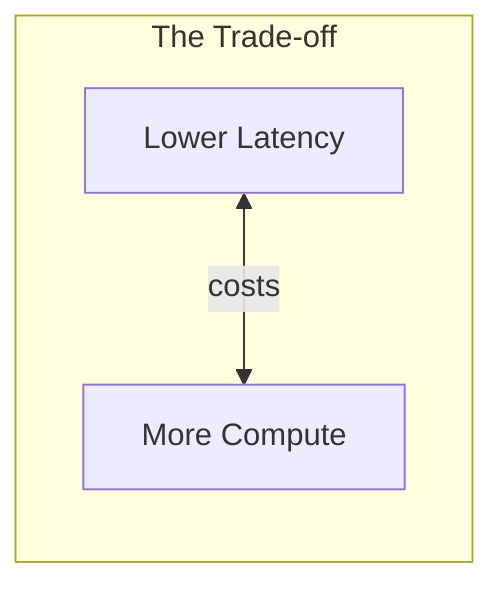

# Speculative Execution: Running Tasks Before You Know You Need Them

> Betting on the future to win time in the present

## The Waiting Problem

AI workflows are latency-bound. Each step waits for the previous one.

| Operation | Typical Latency |
|-----------|-----------------|
| LLM call | 500ms - 3s |
| Tool execution | 10ms - 500ms |
| User confirmation | 0 - ∞ |

A 5-step workflow at 1s per LLM call = 5 seconds minimum. Most of that time? Waiting.

## The Speculation Idea

Borrowed from CPU design: **start likely-needed work before you're certain you need it**.

The bet:
1. Predict what task comes next (using graph patterns)
2. Start that task in parallel with current work
3. If prediction correct → result is ready, no wait
4. If prediction wrong → discard and continue normally

The key insight: **wrong predictions cost compute, not correctness**. You just throw away wasted work.

## When To Speculate

Not all predictions are equal. The decision depends on confidence and cost.

| Confidence | Action | Reasoning |
|------------|--------|-----------|
| >90% | Speculate immediately | High hit rate, low waste |
| 70-90% | Speculate if cheap | Worth the gamble on low-cost tasks |
| <70% | Wait | Too much wasted work |

**Cost matters too:**

A cheap speculation at 70% confidence might be worth it. An expensive speculation at 90% might not be.

## The GraphRAG Advantage

This is where our graph structure pays off. The graph knows:

| Signal | What It Tells Us |
|--------|------------------|
| **Edge weights** | How often tasks follow each other |
| **PageRank** | Which tasks are important |
| **Capabilities** | Natural task groupings |
| **Historical success** | What actually worked before |

After `git_commit`, the graph might show:
- `github_push`: 95% (almost always follows)
- `slack_notify`: 60% (often follows)
- `aws_deploy`: 20% (rarely follows directly)

We speculate on `github_push` immediately. The graph learned this pattern from usage.

## Handling Wrong Predictions

Wrong predictions must be harmless. The strategy:

### 1. Sandbox Speculative Work

Speculative tasks run in isolation:
- No permanent side effects
- Results held in memory only
- External calls deferred or mocked

### 2. Confirm Before Commit

### 3. Learn From Misses

Wrong predictions aren't just discarded—they're feedback:
- Decrease edge weight for that transition
- The graph gets smarter over time
- Fewer wasted speculations in the future

## Performance Trade-offs

The fundamental trade-off: **compute for latency**.

| Factor | Impact |
|--------|--------|
| Successful speculation | Latency saved = task duration |
| Failed speculation | Compute wasted = task cost |
| Hit rate | Determines if trade-off is worth it |

The break-even point depends on your hit rate and cost ratio. We use a 70% confidence threshold with adaptive adjustment.

**When it's worth it:**
- Interactive workflows where user waits
- High-confidence prediction scenarios
- Cheap speculative operations

**When it's not:**
- Batch processing (latency doesn't matter)
- Expensive operations (compute cost too high)
- Low-confidence predictions (too much waste)

---

## References

- CPU speculation (branch prediction) as inspiration

#Performance #Speculation #Optimization #Parallelism
