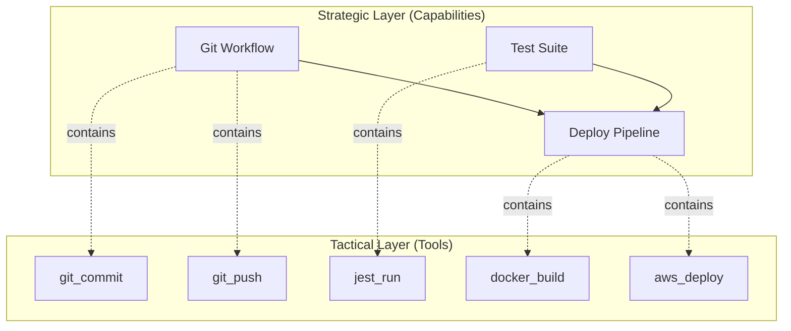
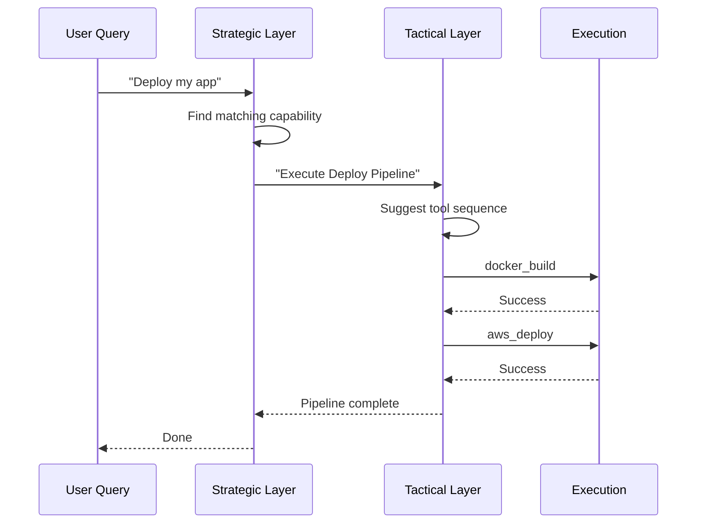
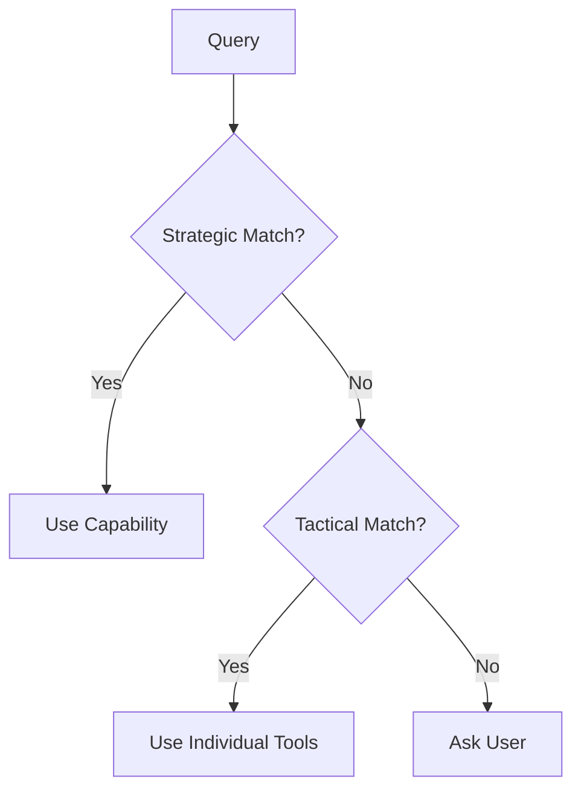
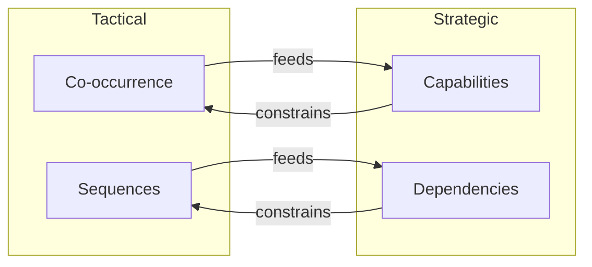

# Two-Layer Architecture: Tactical vs Strategic Intelligence

> Fast and slow thinking for AI agents

## The Scaling Problem

With 10 tools, a single graph works fine. With 100 tools, it gets messy. With 1,000+ tools, it becomes unusable.

The problem: **different questions need different granularity**.

| Question | Granularity Needed |
|----------|-------------------|
| "What tool should I call next?" | Fine (individual tools) |
| "What skill solves this problem?" | Coarse (capability clusters) |

One graph can't serve both well. So we built two.

## The Two Layers

### Tactical Layer: Fast Decisions

**Purpose:** "Given this context, what's the next tool?"

| Aspect | Details |
|--------|---------|
| **Nodes** | Individual MCP tools |
| **Edges** | Co-occurrence, sequence |
| **Structure** | Simple weighted graph |
| **Query time** | Milliseconds |
| **Updates** | Every workflow |

**Algorithms used:**
- Semantic similarity (vector search)
- Adamic-Adar (common neighbor strength)
- Louvain clustering (community detection)

### Strategic Layer: Thoughtful Planning

**Purpose:** "What skill/capability applies here?"

| Aspect | Details |
|--------|---------|
| **Nodes** | Capabilities, meta-capabilities |
| **Edges** | Contains, dependency, provides |
| **Structure** | n-SuperHyperGraph (recursive) |
| **Query time** | Seconds |
| **Updates** | Hourly clustering |

**Algorithms used:**
- Spectral clustering (capability detection)
- Hypergraph PageRank (importance)
- SHGAT (attention, coming soon)

## How They Work Together

### The Flow

1. **Query arrives** → Strategic layer matches intent to capability
2. **Capability selected** → Tactical layer plans tool sequence
3. **Execution starts** → Tactical layer suggests next tool at each step
4. **Learning happens** → Both layers update from outcomes

## Why Two Layers?

### 1. Different Update Frequencies

| Layer | Update Frequency | Why |
|-------|-----------------|-----|
| Tactical | Every workflow | Tool relationships change fast |
| Strategic | Hourly/daily | Capabilities are stable patterns |

Running spectral clustering on every request would be too slow. Running it hourly is fine because capabilities don't change that fast.

### 2. Different Query Patterns

**Tactical queries:** "I just ran git_commit, what's next?"
- Needs: immediate neighbors in graph
- Speed: must be instant

**Strategic queries:** "How do I deploy to production?"
- Needs: capability matching, dependency resolution
- Speed: can take a second

### 3. Different Failure Modes

When tactical fails (unknown tool), strategic can still suggest capabilities.

When strategic fails (no matching capability), tactical can still suggest individual tools.

**Graceful degradation:**

### 4. Different Optimization Targets

| Layer | Optimizes For |
|-------|--------------|
| Tactical | Speed, local accuracy |
| Strategic | Coverage, global coherence |

## Cross-Layer Communication

The layers aren't isolated. They share information:

### Tactical → Strategic

- Tool co-occurrence patterns feed clustering
- Workflow success rates update capability confidence
- New tool combinations suggest capability expansion

### Strategic → Tactical

- Capability boundaries constrain tool suggestions
- PageRank scores boost important tools
- Dependency edges prevent invalid sequences

## The Scaling Benefit

The key insight: capabilities compress the search space.

| Approach | Search Complexity |
|----------|-------------------|
| Single Layer | O(n²) where n = all tools |
| Two Layers | O(n) + O(k²) where k = capabilities |

Since k << n (typically 10-20 capabilities vs 100+ tools), the strategic layer acts as a **compression layer**—reducing the problem size before tactical execution.

As tool count grows, the two-layer approach pays off increasingly.

## When To Use Each

| Situation | Layer | Why |
|-----------|-------|-----|
| First query, cold start | Strategic | Find relevant capability |
| Mid-workflow, next step | Tactical | Speed matters |
| Unknown intent | Strategic | Capability matching |
| Known capability | Tactical | Direct tool sequence |
| Learning from outcome | Both | Update co-occurrence + confidence |

## The Mental Model

Think of it like human cognition:

- **Strategic** = System 2 thinking (slow, deliberate, planning)
- **Tactical** = System 1 thinking (fast, automatic, reactive)

You don't consciously think about each keystroke when typing. But you do think about what email to write.

Same principle for AI agents.

---

## References

- Kahneman, D. (2011). *Thinking, Fast and Slow*.

#Architecture #TwoLayer #SystemDesign #Scaling
