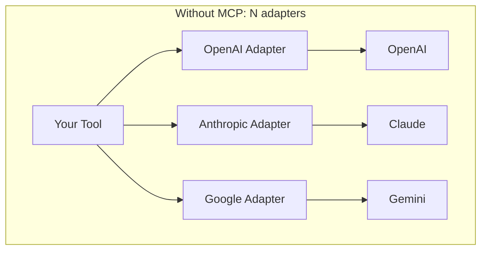
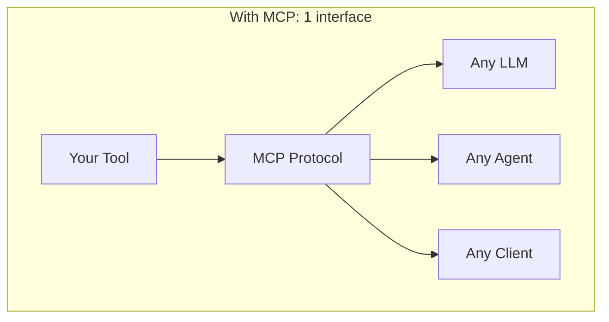
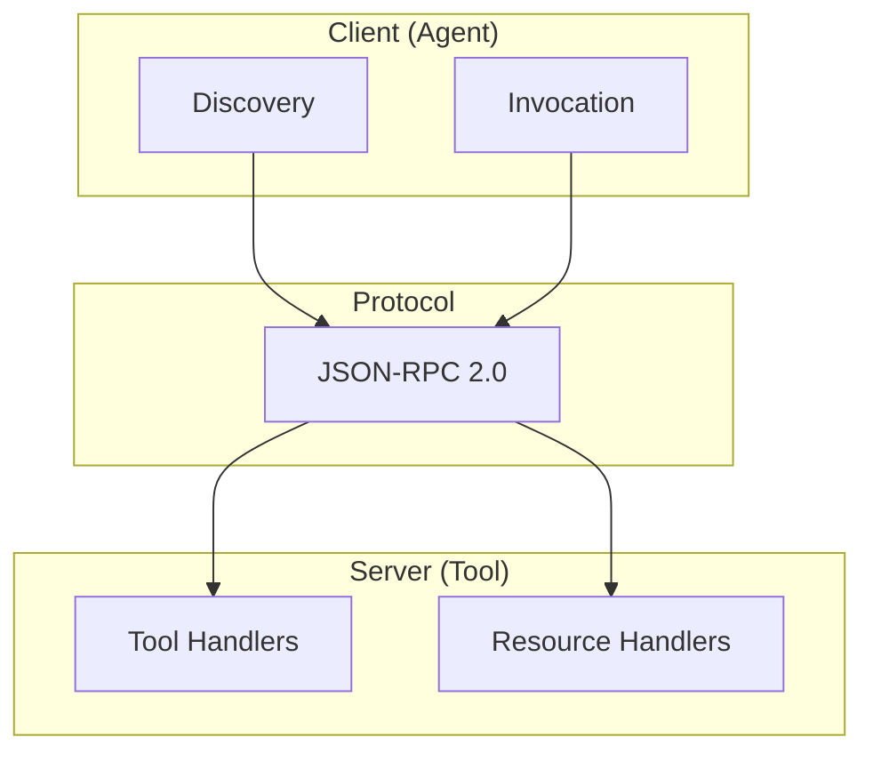
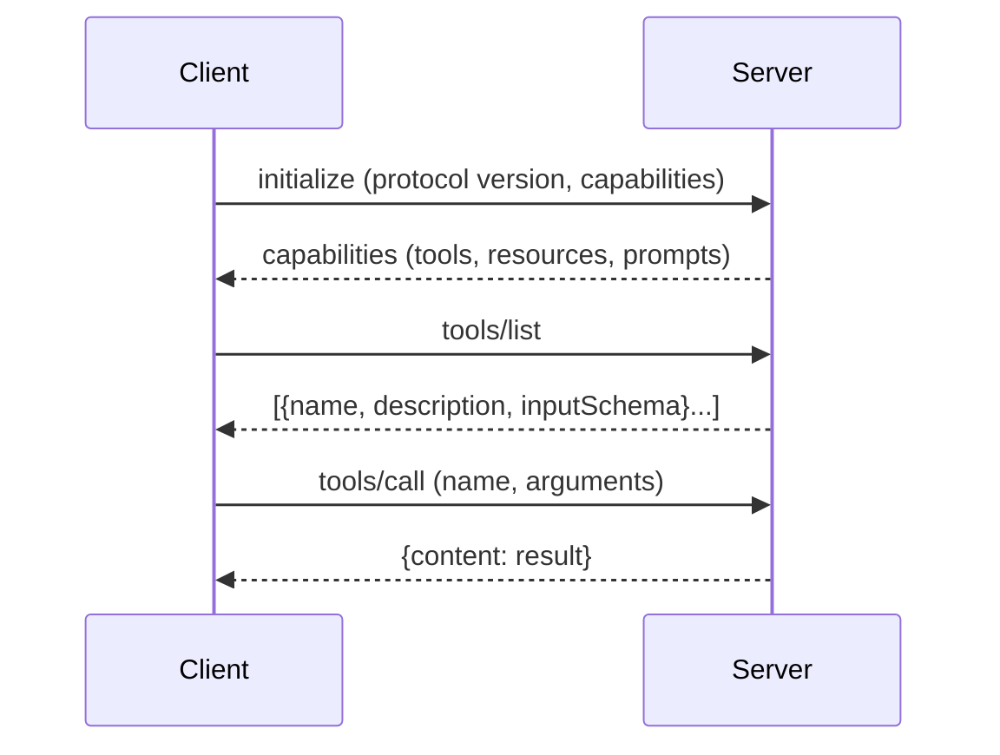

# Why MCP Protocol: The Universal Language for AI Tools

> From vendor lock-in to universal interoperability

## The Problem With Function Calling

Every LLM provider invented their own tool interface:

| Provider | Format | Schema |
|----------|--------|--------|
| OpenAI | `functions` / `tools` | JSON Schema |
| Anthropic | `tool_use` | JSON Schema (different structure) |
| Google | `function_declarations` | Protocol Buffers |
| Mistral | `tool_calls` | OpenAI-compatible-ish |

Same concept, different implementations. Want to support multiple models? Write adapters for each.

**The maintenance burden grows with each new model.**

## What Is MCP?

**Model Context Protocol** is an open standard for tool integration. Think USB for AI tools—one interface, universal compatibility.

| Aspect | Details |
|--------|---------|
| Created by | Anthropic (open-sourced Nov 2024) |
| Transport | JSON-RPC 2.0 |
| Primitives | Tools, Resources, Prompts |
| License | MIT |

Write once, run everywhere. No more N×M adapter matrix.

## Why We Chose MCP

Our reasoning came down to four factors:

### 1. Vendor Independence

Today we use Claude. Tomorrow? Who knows. MCP means our tools work with any model that supports the protocol—and that list is growing.

### 2. Ecosystem Growth

MCP has momentum:
- Claude Desktop, Cursor, VS Code extensions support it
- 100+ open source servers available
- Major IDE integrations coming

### 3. Clean Separation

MCP enforces good architecture:
- **Server**: Exposes capabilities (tools, resources)
- **Client**: Discovers and invokes
- **Transport**: Pluggable (stdio, HTTP, WebSocket)

Your tool logic stays clean. Protocol handling is separate.

### 4. Simplicity

Stdio transport means any language works. No HTTP server needed. Just read stdin, write stdout.

| Approach | Pros | Cons |
|----------|------|------|
| Native function calling | Tight integration | Vendor lock-in |
| Custom adapters | Full control | Maintenance burden |
| **MCP** | Universal, growing ecosystem | Newer, evolving |

## The MCP Architecture

Three layers, cleanly separated:

### The Handshake

### Primitives

| Primitive | Purpose | Example |
|-----------|---------|---------|
| **Tools** | Actions the model can take | `file_read`, `git_commit` |
| **Resources** | Data the model can access | File contents, DB rows |
| **Prompts** | Reusable prompt templates | Coding assistant setup |

## Practical Benefits

What MCP gives us in practice:

### Swap Models Freely

Our tools work unchanged whether we use Claude, GPT, or local models. The abstraction holds.

### Share Across Projects

One MCP server can be used by:
- CLI agents
- Web applications
- IDE extensions
- Other teams' projects

### Tap Into the Ecosystem

Existing MCP servers we can use immediately:
- **Filesystem**: Read/write files
- **GitHub**: PRs, issues, repos
- **Postgres/SQLite**: Database access
- **Brave Search**: Web search
- **Puppeteer**: Browser automation

No integration work. Just configure and use.

### Future-Proof

As the AI landscape evolves, MCP-compatible tools remain relevant. New models adopt MCP → our tools work with them automatically.

---

## References

- [Model Context Protocol Specification](https://modelcontextprotocol.io)

#MCP #Protocol #Interoperability #AITools
